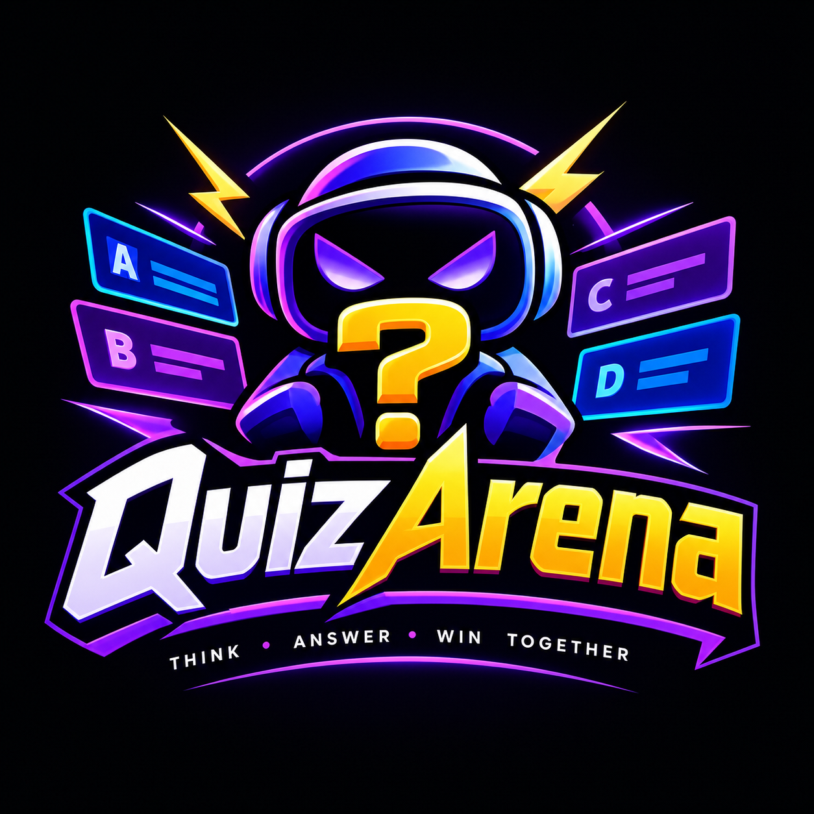
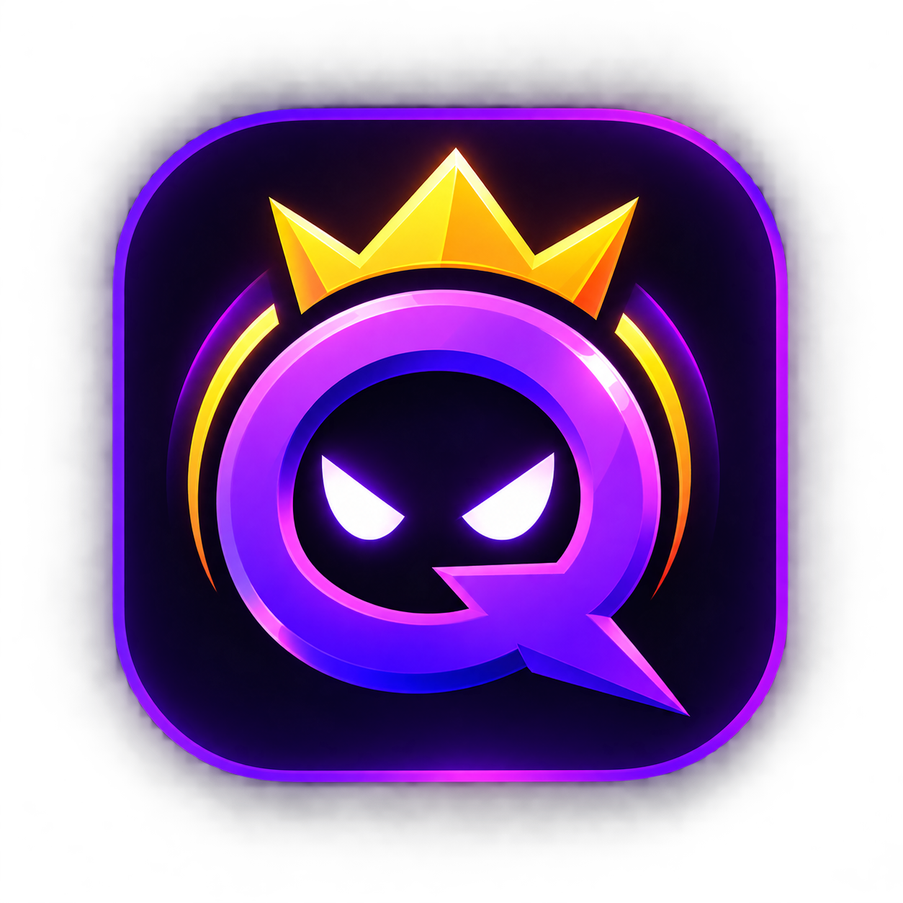
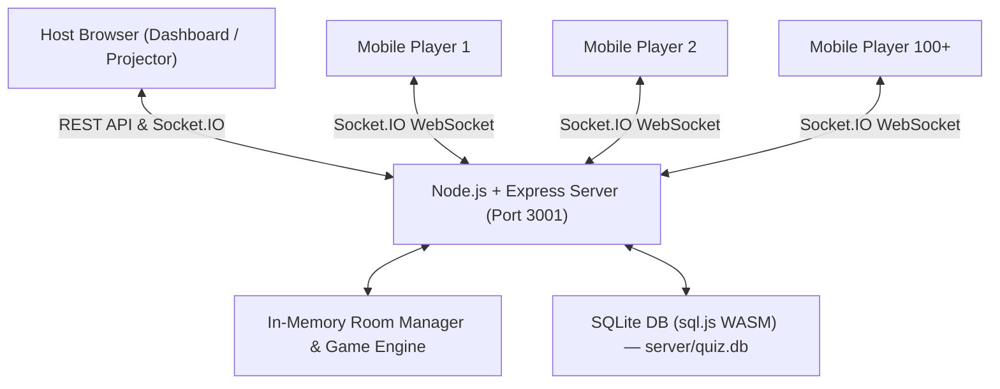

<p align="center">
  
</p>

<h1 align="center">
  &nbsp; QuizArena
</h1>

<p align="center">
  <strong>A high-performance, real-time, Kahoot-style live quiz platform designed to run 100% locally or across a Local Area Network (LAN).</strong><br/>
  Zero cloud dependencies. Zero external subscriptions. No build toolchain nightmares.
</p>

<p align="center">
  
  
  
  
  
</p>

---

## 📋 Table of Contents

- [Overview](#-overview)
- [Key Features](#-key-features)
- [Architecture & Tech Stack](#️-architecture--tech-stack)
- [Project Structure](#-project-structure)
- [Prerequisites](#-prerequisites)
- [Setup & Installation](#-setup--installation)
  - [Option A — One-Click Start (Windows)](#option-a--one-click-start-windows)
  - [Option B — Manual Terminal Launch](#option-b--manual-terminal-launch)
  - [Option C — Production Build (LAN Mode)](#option-c--production-build-lan-mode)
- [Using QuizArena](#-using-quizarena)
  - [Step 1 — Open the Host Dashboard](#step-1--open-the-host-dashboard)
  - [Step 2 — Create or Import a Quiz](#step-2--create-or-import-a-quiz)
  - [Step 3 — Build Your Questions](#step-3--build-your-questions)
  - [Step 4 — Launch the Game](#step-4--launch-the-game)
  - [Step 5 — Players Join](#step-5--players-join)
  - [Step 6 — Run the Quiz](#step-6--run-the-quiz)
- [LAN / Wi-Fi Multiplayer Guide](#-lan--wi-fi-multiplayer-guide)
  - [How Players Connect](#how-players-connect)
  - [Windows Firewall Setup](#windows-firewall-setup)
- [JSON Quiz Import & Export](#-json-quiz-import--export)
  - [Importing a Quiz](#importing-a-quiz)
  - [Supported JSON Formats](#supported-json-formats)
  - [Field Normalization Reference](#field-normalization-reference)
  - [Exporting Quizzes](#exporting-quizzes)
- [Game Engine & Scoring](#-game-engine--scoring)
- [REST API Reference](#-rest-api-reference)
- [Socket.IO Event Reference](#-socketio-event-reference)
- [Testing & Load Testing](#-testing--load-testing)
- [Troubleshooting & FAQ](#-troubleshooting--faq)
- [License](#-license)

---

## 🔭 Overview

**QuizArena** brings the excitement of synchronized, multiplayer trivia to schools, hackathons, team hangouts, and live events. One person hosts the quiz from their laptop, projecting questions and live scoreboards on a screen. Participants connect instantly via smartphones, tablets, or laptops over local Wi-Fi — no accounts, no app installs, no passwords.

Everything is self-hosted:
- State management runs **in-memory** with sub-millisecond Socket.IO message dispatching.
- Persistent quiz data is stored in a **local SQLite database** powered by WebAssembly (no native C++ build tools needed).
- The entire stack starts with a **single double-click** on Windows.

---

## ✨ Key Features

### 🖥️ Host Experience
| Feature | Description |
|---|---|
| **Quiz Builder** | Create multiple-choice quizzes with rich prompts, 4 answer options, per-question timers (5–300s), and custom point values (up to 10,000 pts) |
| **JSON Import** | Drag-and-drop `.json` upload or paste raw JSON with instant live validation and preview |
| **JSON Export** | Download any quiz as a `.json` file for backup, sharing, or re-importing on another machine |
| **6-Digit Room PIN** | Automatically generated, collision-free session PIN displayed large for projectors |
| **Live Lobby** | Real-time animated grid of joining player nicknames with live count |
| **Answer Tracker** | Watch answer submissions arrive in real time (`X / Y answered`) |
| **Pause & Resume** | Halt the timer for discussion without losing player state |
| **Skip Question** | Advance immediately when ready |
| **Leaderboard** | Animated rank movements (↑ rose, ↓ dropped, — steady) with 🥇🥈🥉 podium medals |
| **Session Safeguard** | Confirmation dialog prevents accidental session-end clicks |

### 📱 Player Experience
| Feature | Description |
|---|---|
| **Mobile-First UI** | Minimum 44px touch targets, optimized for phones |
| **No Sign-Up** | Join with only a PIN and an optional nickname |
| **Instant Answer Lock** | Tapping an option locks selection immediately, preventing double-taps |
| **Live Feedback** | Correct/incorrect verdict with points earned and rank delta after each question |
| **Auto-Reconnect** | `sessionStorage` tokens restore the player's score and state if they refresh or reconnect |

---

## 🛠️ Architecture & Tech Stack



| Layer | Technology | Notes |
|---|---|---|
| **Backend** | Node.js v18+ · Express 4.x | Single process, async I/O |
| **Real-time** | Socket.IO 4.7+ | WebSocket transport, automatic room isolation |
| **Database** | SQLite via `sql.js` (WASM) | Zero native build tools required; persisted to `server/quiz.db` |
| **Frontend** | React 18 · React Router v6 | SPA with clean host/player route separation |
| **Build Tool** | Vite 5.x | Instant HMR dev server; optimized production bundle |
| **Design** | Vanilla CSS | Dark theme, HSL palette, CSS variables, fluid animations |

**Port layout in development:**

| Service | URL | Purpose |
|---|---|---|
| Backend API + Socket.IO | `http://localhost:3001` | REST API, WebSocket hub, serves production build |
| Vite Dev Server | `http://localhost:5173` | Hot-reload frontend (dev only) |

> **Note:** In development (`npm run dev`), the Vite dev server at `:5173` proxies all `/api` and socket requests to `:3001`. In production (built mode), both are served from port **3001** only.

---

## 📁 Project Structure

```
quizarena/
├── start.bat                    # ⚡ One-click Windows startup script
├── package.json                 # Root dependencies & npm scripts
├── README.md                    # This file
│
├── loadtest/
│   └── simulate.js              # High-concurrency load test (100+ clients)
│
├── server/
│   ├── index.js                 # Express + Socket.IO entry point (port 3001)
│   ├── db.js                    # SQLite init, seed logic, and CRUD wrappers
│   ├── quiz.db                  # ← Auto-created SQLite database file (gitignored)
│   ├── test-import.js           # Automated test suite for import/export
│   ├── routes/
│   │   └── quizzes.js           # REST CRUD, JSON import/export endpoints
│   └── socket/
│       ├── index.js             # Socket event registration & lifecycle
│       ├── roomManager.js       # In-memory room state, player registry, PIN generator
│       ├── gameEngine.js        # Timer loop, speed-based scoring, leaderboard compute
│       └── reconnect.js         # Session token issuance & state-sync restoration
│
└── client/
    ├── index.html               # HTML shell with Inter font & viewport meta
    ├── vite.config.js           # Vite config with /api & socket reverse-proxy to :3001
    └── src/
        ├── main.jsx             # React root mount point
        ├── App.jsx              # Route definitions
        ├── socket.js            # Shared Socket.IO client singleton
        ├── index.css            # Global design tokens, surfaces, animation keyframes
        ├── components/
        │   ├── Icons.jsx        # Unified SVG icon system
        │   └── ImportQuizModal.jsx  # Drag-and-drop + paste JSON import dialog
        ├── host/
        │   ├── Dashboard.jsx    # Quiz library, import/export, create modal, launch
        │   ├── QuizBuilder.jsx  # Question editor, export JSON, import questions
        │   ├── Lobby.jsx        # Large PIN display, animated joining player grid
        │   ├── LiveQuestion.jsx # Host question view, live answer count, Pause/Skip/End
        │   └── Leaderboard.jsx  # Ranked scores, rank movements, next question button
        └── player/
            ├── Join.jsx         # PIN & nickname input with inline validation
            ├── Waiting.jsx      # Waiting room with avatar initial & animated dots
            ├── Question.jsx     # 4 color+shape answer tiles & countdown progress bar
            └── Result.jsx       # Correct/incorrect feedback, points breakdown, rank
```

---

## 📦 Prerequisites

| Requirement | Version | Where to get it |
|---|---|---|
| **Node.js** | v18.0.0 or higher | [nodejs.org](https://nodejs.org/) |
| **npm** | v9.0.0 or higher | Bundled with Node.js |

Verify your installation before proceeding:

```bash
node --version   # should print v18.x.x or higher
npm --version    # should print 9.x.x or higher
```

---

## 🚀 Setup & Installation

### Option A — One-Click Start (Windows)

> ✅ **Recommended for most users.** No terminal knowledge required.

1. Download or clone the repository to your computer.
2. **Double-click `start.bat`** in the project root folder.

The script automatically:
1. Checks that Node.js and npm are installed.
2. Detects missing `node_modules` and runs `npm install` on first launch.
3. Frees ports 3001 and 5173 if they are occupied from a previous session.
4. Starts the backend server **and** the Vite dev frontend concurrently.
5. Opens your default browser to `http://localhost:3001/` after a 3-second delay.

**What you'll see in the terminal:**
```
============================================================
  QuizArena - Live Host-Run Quiz Platform
============================================================

[INFO] Starting QuizArena Backend [Port 3001] and Frontend [Port 3001]...

  Host Dashboard : http://localhost:3001/
  Player Join    : http://localhost:3001/join

Press Ctrl+C in this terminal window to stop all servers.
============================================================
```

---

### Option B — Manual Terminal Launch

For macOS, Linux, or Windows users who prefer the command line:

```bash
# 1. Clone the repository
git clone https://github.com/your-username/quizarena.git
cd quizarena

# 2. Install all dependencies (only needed once)
npm install

# 3. Start backend + frontend concurrently
npm run dev
```

Once started, you'll see output from both servers:

```
✅ Database ready

🎯 QuizArena server running
   Local:  http://localhost:3001
   LAN:    http://192.168.x.x:3001

   Host dashboard: http://localhost:3001/
   Player join:    http://192.168.x.x:3001/join
```

**Access the app:**
- **Host Dashboard** → `http://localhost:3001/`
- **Player Join page** → `http://localhost:3001/join`

> 💡 **First-run database seed:** On the very first startup, QuizArena auto-creates a sample 4-question quiz ("World Trivia & Science Showdown") so you can test immediately without creating any content.

---

### Option C — Production Build (LAN Mode)

Running in production mode serves everything from a **single port (3001)** — no Vite dev server needed. This is the recommended mode for actual live events where stability matters.

```bash
# 1. Build the frontend bundle
npx vite build client

# 2. Start only the backend server
npm run dev:server
```

The backend will automatically detect and serve the built frontend from `client/dist/`. Players and the host both connect to port **3001** directly.

Confirm LAN IP in the terminal output:
```
🎯 QuizArena server running
   Local:  http://localhost:3001
   LAN:    http://192.168.1.42:3001        ← Share this with players
```

---

## 🎮 Using QuizArena

### Step 1 — Open the Host Dashboard

Navigate to **`http://localhost:3001/`** in your browser (or LAN IP on other machines). This is the Host Dashboard — the control center for creating and launching quizzes.

---

### Step 2 — Create or Import a Quiz

You have three ways to get a quiz ready:

#### A. Create a new quiz
1. Type a title in the **"New Quiz Title"** input field.
2. Click **"Create Quiz"**.
3. The new (empty) quiz appears in the library — click **"Edit"** to start adding questions.

#### B. Import a quiz from JSON
1. Click **"Import JSON"** in the top navigation bar.
2. Choose between **Upload File** (drag & drop `.json`) or **Paste JSON** tabs.
3. Optionally click **"Load Sample"** to try a ready-made quiz, or **"Download Template"** to get a starter file.
4. Review the live preview showing detected quiz titles, question counts, and any validation errors.
5. Click **"Import Quiz"** — the quiz appears in your library immediately.

> See the full [JSON Import & Export](#-json-quiz-import--export) section for format details.

#### C. Use the pre-seeded sample quiz
On first run, a "World Trivia & Science Showdown" quiz is automatically available in your library — no setup needed.

---

### Step 3 — Build Your Questions

Click **"Edit"** on any quiz to open the **Quiz Builder** at `/build/:quizId`.

**Adding a question:**
1. Click **"Add Question"** (the ＋ button in the top right).
2. Fill in the **Question Prompt** (required).
3. Enter **2 to 4 answer options** — at least 2 are required.
4. Click the radio button next to the correct option to mark it.
5. Adjust the **Time Limit** (5–300 seconds, default 20s).
6. Adjust **Base Points** (0–10,000, default 1,000).
7. Click **"Save Question"**.

**Editing an existing question:**  
Click the pencil icon on any question card. Make your changes, then click **"Save"**.

**Deleting a question:**  
Click the trash icon on a question card. The deletion is immediate.

**Reordering questions:**  
Questions are displayed in insertion order. To reorder, delete and re-add questions in the desired sequence.

**Importing questions into the current quiz:**  
Click **"Import Questions"** in the top bar to bulk-append questions from a JSON array into the quiz you are editing.

**Exporting the current quiz:**  
Click **"Export"** in the top bar to download the quiz as a `.json` file.

---

### Step 4 — Launch the Game

From the **Dashboard**, click the **▶ Play** button on the quiz you want to run.

The server:
1. Assigns a unique **6-digit room PIN** to the session.
2. Takes you to the **Lobby screen** showing the PIN in large text (ideal for projecting).

Share the PIN with players. They navigate to `/join` and enter the PIN.

---

### Step 5 — Players Join

Players open a browser on any device connected to the **same network** and navigate to:

```
http://localhost:3001/join        (if on the same machine)
http://192.168.x.x:3001/join     (for phones/tablets on the same Wi-Fi)
```

1. Enter the **6-digit PIN**.
2. Type an optional **nickname** (defaults to "Player" if left blank).
3. Tap **"Join"**.

Players see a waiting room with their avatar and a live "Waiting for host..." animation. As players join, the host's Lobby updates in real time.

---

### Step 6 — Run the Quiz

Once players are in the lobby, click **"Start Quiz"** on the host screen.

**During each question:**
- The host screen shows the question, color-coded answer tiles, a countdown bar, and a live answer count (`X / Y answered`).
- Player screens show only the 4 color+shape answer tiles — no question text (Kahoot-style).
- Players tap to lock in their answer. Re-tapping is not possible.
- **Pause**: Freezes the timer for all players while you discuss something.
- **Skip**: Ends the current question immediately and shows results.
- **End Session**: Ends the entire quiz with a confirmation prompt.

**After each question:**
- Correct answer is revealed on the host screen.
- Players see an immediate **Correct ✓** or **Incorrect ✗** verdict with points earned and their current rank.
- Host clicks **"Next Question"** to proceed.

**After the final question:**
- A full leaderboard is shown with 🥇🥈🥉 medals for the top 3.
- Players see their final rank and score.
- The host can click **"End & Return to Dashboard"** to close the session.

---

## 📡 LAN / Wi-Fi Multiplayer Guide

### How Players Connect

To host a live game where players connect from their own devices:

1. Ensure all devices (host machine and all player phones/tablets) are on the **same Wi-Fi network or router**.
2. Start the server using either Option A, B, or C above.
3. Find your **LAN IP address** in the terminal output:
   ```
   LAN:    http://192.168.1.42:3001
   ```
   Alternatively, find it manually:
   - **Windows**: Run `ipconfig` in a terminal — look for `IPv4 Address`.
   - **macOS/Linux**: Run `ifconfig` or `ip addr` — look for `inet` under your Wi-Fi adapter.
4. Project your host screen or share the **6-digit PIN** verbally.
5. Players navigate to `http://192.168.1.42:3001/join` (use your actual LAN IP).

> ⚠️ The Vite dev server (`:5173`) is accessible only from the **host machine**. For LAN multiplayer with phones, use the **production build** (Option C) so everyone connects to `:3001`.

---

### Windows Firewall Setup

If player devices cannot load the page, Windows Firewall is likely blocking inbound connections on port 3001.

**Option 1 — PowerShell (recommended, run as Administrator):**
```powershell
New-NetFirewallRule -DisplayName "QuizArena Port 3001" -Direction Inbound -LocalPort 3001 -Protocol TCP -Action Allow
```

**Option 2 — Windows Defender Firewall UI:**
1. Open **Windows Defender Firewall** → **Advanced Settings**.
2. Click **Inbound Rules** → **New Rule**.
3. Select **Port** → TCP → specific port **3001**.
4. Select **Allow the connection** → apply to all profiles → name it "QuizArena".

**To remove the rule later:**
```powershell
Remove-NetFirewallRule -DisplayName "QuizArena Port 3001"
```

---

## 📥 JSON Quiz Import & Export

QuizArena includes a comprehensive import/export engine allowing hosts, educators, and event organizers to create, share, and backup quizzes in standard JSON format. The parser is intentionally flexible and accepts many real-world formats.

---

### Importing a Quiz

#### From the Dashboard
1. Click **"Import JSON"** in the top navigation bar.
2. Choose a tab:
   - **Upload File**: Drag & drop a `.json` file or click to browse your computer.
   - **Paste JSON**: Paste raw JSON text into the editor box.
3. The modal instantly parses your input and shows a **live preview**:
   - Number of quizzes/questions detected.
   - First question preview.
   - Any validation errors highlighted in red.
4. Fix any errors if shown (the import button is disabled while errors exist).
5. Click **"Import Quiz"** — the quiz is saved and appears in the Dashboard library.

#### From the Quiz Builder (Append Questions)
1. Open any quiz in the Quiz Builder.
2. Click **"Import Questions"** in the top bar.
3. Paste or upload a JSON array of question objects.
4. Questions are appended to the end of the existing quiz.

---

### Supported JSON Formats

The parser auto-detects and normalizes these input structures:

#### Format 1 — Standard Single Quiz (Recommended)
```json
{
  "title": "Cosmic Science Trivia",
  "questions": [
    {
      "text": "Which planet has the most moons?",
      "options": ["Mars", "Saturn", "Jupiter", "Neptune"],
      "correct_option_index": 1,
      "time_limit_seconds": 20,
      "points_value": 1000
    },
    {
      "text": "What is the chemical symbol for Gold?",
      "options": ["Ag", "Fe", "Au", "Gd"],
      "correct_option_index": 2,
      "time_limit_seconds": 15,
      "points_value": 1200
    }
  ]
}
```

#### Format 2 — Multi-Quiz Batch Array
Import multiple quizzes in one file upload:
```json
[
  {
    "title": "History Showdown",
    "questions": [
      {
        "text": "Who invented the printing press?",
        "options": ["Newton", "Gutenberg", "Edison", "Tesla"],
        "correct_option_index": 1
      }
    ]
  },
  {
    "title": "Geography Challenge",
    "questions": [
      {
        "text": "What is the capital of Australia?",
        "options": ["Sydney", "Melbourne", "Canberra", "Brisbane"],
        "correct_option_index": 2
      }
    ]
  }
]
```

#### Format 3 — AI-Generated / Flexible Format
The parser accepts common field variants from ChatGPT, Gemini, Claude exports and Kahoot-compatible formats:
```json
{
  "name": "Biology 101",
  "questions": [
    {
      "question": "What is the powerhouse of the cell?",
      "choices": [
        { "text": "Nucleus",      "isCorrect": false },
        { "text": "Mitochondria", "isCorrect": true  },
        { "text": "Ribosome",     "isCorrect": false }
      ]
    },
    {
      "prompt": "Which organelle synthesizes proteins?",
      "answers": ["Mitochondria", "Ribosome", "Golgi apparatus", "Lysosome"],
      "answer": "Ribosome"
    },
    {
      "text": "DNA is double-stranded. True or False?",
      "options": ["True", "False"],
      "correct": "A"
    }
  ]
}
```

#### Format 4 — Plain Question Array
A bare array of question objects (no quiz wrapper) is treated as a single quiz titled "Imported Quiz":
```json
[
  {
    "text": "What year did World War II end?",
    "options": ["1943", "1944", "1945", "1946"],
    "correct_option_index": 2
  }
]
```

---

### Field Normalization Reference

| Field | Accepted Keys | Notes |
|---|---|---|
| **Quiz title** | `title`, `name` | Falls back to `"Imported Quiz"` |
| **Questions list** | `questions`, `items` | Must be an array |
| **Question prompt** | `text`, `question`, `prompt`, `title` | Required; trimmed |
| **Answer options** | `options`, `answers`, `choices` | 2–4 items required; max 4 used |
| **Option text** (object) | `text`, `option`, `answer`, `label` | Used when options is array of objects |
| **Correct flag** (object) | `isCorrect`, `correct`, `is_correct` | Set to `true` on the correct option object |
| **Correct index** | `correct_option_index`, `correctIndex` | 0-based integer; 1-based auto-corrected |
| **Correct by value** | `answer`, `correct_answer`, `correctAnswer` | Matched case-insensitively against option text |
| **Correct by letter** | `correct: "B"` | `"A"` → 0, `"B"` → 1, `"C"` → 2, `"D"` → 3 |
| **Time limit** | `time_limit_seconds`, `timeLimit`, `time` | Range: 5–300s; default: 20s |
| **Points value** | `points_value`, `points`, `score` | Range: 0–10,000; default: 1,000 |

---

### Exporting Quizzes

| Method | How |
|---|---|
| **Dashboard card** | Click the 📥 download icon on any quiz card |
| **Quiz Builder** | Click the **"Export"** button in the header |
| **Direct API** | `GET http://localhost:3001/api/quizzes/:id/export` in your browser |

Exported files are standard JSON following Format 1 above and can be re-imported on any QuizArena instance.

---

## 🎯 Game Engine & Scoring

### Speed-Based Scoring Formula

Points are computed entirely **server-side** based on the precise timestamp of answer receipt:

$$\text{Points} = \text{round}\left(\text{Base Points} \times \left(1 - \min\left(\frac{\Delta t}{T_{\text{limit}}}, 1\right) \times 0.5\right)\right)$$

Where:
- **Base Points** — configured per question (default: 1,000).
- **Δt** — server-measured milliseconds elapsed since the question was broadcast.
- **T_limit** — question time limit in milliseconds.

| Scenario | Score |
|---|---|
| Incorrect answer | 0 pts |
| Correct answer, instant tap | 100% of base points (1,000 pts) |
| Correct answer, halfway through time | ~75% of base points (750 pts) |
| Correct answer, last second | 50% floor of base points (500 pts) |
| No answer submitted | 0 pts |

### Session Reconnect & State Recovery

Mobile browsers sleep and refresh frequently. QuizArena prevents score loss:

1. When a player joins, the server issues a **cryptographically unique `sessionToken`** (UUIDv4) stored in the player's browser `sessionStorage`.
2. If the player refreshes or their socket drops, the client automatically emits `player:reconnect` with `{ pin, sessionToken }`.
3. The server re-associates the socket with the existing player profile and restores:
   - Accumulated total score.
   - Current question state (if a question is active) — including the fact that they already answered.
   - Whether to go to the waiting screen (if between questions).

---

## 🌐 REST API Reference

Base URL: `http://localhost:3001/api`

| Method | Endpoint | Description | Request Body |
|---|---|---|---|
| `GET` | `/health` | Service health check | — |
| `GET` | `/quizzes` | List all quizzes with question counts | — |
| `POST` | `/quizzes` | Create a new empty quiz | `{ "title": "My Quiz" }` |
| `GET` | `/quizzes/:id` | Get quiz details and full question list | — |
| `PUT` | `/quizzes/:id` | Update quiz title | `{ "title": "New Title" }` |
| `DELETE` | `/quizzes/:id` | Delete quiz and all its questions | — |
| `POST` | `/quizzes/import` | Import one or many quizzes from JSON | Quiz object or array |
| `GET` | `/quizzes/:id/export` | Download quiz as JSON file | — |
| `POST` | `/quizzes/:id/import-questions` | Append questions to existing quiz | Array of question objects |
| `POST` | `/quizzes/:id/questions` | Add a single question | See schema below |
| `PUT` | `/quizzes/:id/questions/:qid` | Update a question | Question fields |
| `DELETE` | `/quizzes/:id/questions/:qid` | Delete a question | — |

**Single question schema** (for `POST /quizzes/:id/questions`):
```json
{
  "text": "Question prompt text (required)",
  "options": ["Option A", "Option B", "Option C", "Option D"],
  "correct_option_index": 0,
  "time_limit_seconds": 20,
  "points_value": 1000
}
```

**Example cURL — create a quiz:**
```bash
curl -X POST http://localhost:3001/api/quizzes \
  -H "Content-Type: application/json" \
  -d '{"title":"My New Quiz"}'
```

**Example cURL — import a quiz:**
```bash
curl -X POST http://localhost:3001/api/quizzes/import \
  -H "Content-Type: application/json" \
  -d @myquiz.json
```

---

## 🔌 Socket.IO Event Reference

Connect to `http://localhost:3001` using Socket.IO client.

### Host → Server
| Event | Payload | Description |
|---|---|---|
| `room:create` | `{ quizId }` | Create a new game room |
| `host:control` | `{ pin, action }` | Control flow: `"start"`, `"next"`, `"pause"`, `"resume"`, `"end"` |
| `host:reconnect` | `{ pin }` | Re-attach host socket after disconnect |

### Player → Server
| Event | Payload | Description |
|---|---|---|
| `room:join` | `{ pin, nickname }` | Join room lobby |
| `answer:submit` | `{ pin, sessionToken, optionIdx }` | Submit answer (0-based index) |
| `player:reconnect` | `{ pin, sessionToken }` | Restore session after disconnect |

### Server → Host
| Event | Payload | Description |
|---|---|---|
| `room:created` | `{ pin, quizTitle, questionCount }` | Room created successfully |
| `lobby:update` | `{ players, count }` | Player roster update |
| `answer:count` | `{ answered, total }` | Live answer tally (throttled to 4/sec) |
| `question:results` | `{ correctOptionIndex, leaderboard }` | Round results |
| `quiz:ended` | `{ leaderboard }` | Final leaderboard |

### Server → Player
| Event | Payload | Description |
|---|---|---|
| `room:join:success` | `{ sessionToken, nickname, pin }` | Join confirmed |
| `room:join:error` | `{ message }` | Join failed (bad PIN, full room, etc.) |
| `question:show` | `{ questionIndex, totalQuestions, text, options, timeLimitSeconds, pointsValue }` | New question (no correct answer exposed) |
| `answer:ack` | `{ accepted, reason }` | Confirmation of answer receipt |
| `question:results` | `{ correctOptionIndex, personal: { correct, pointsEarned, totalScore, rank } }` | Per-player round result |
| `quiz:paused` | — | Timer paused by host |
| `quiz:resumed` | — | Timer resumed |
| `room:closed` | `{ reason }` | Session ended |
| `reconnect:success` | `{ question, phase }` | Session restored after reconnect |

---

## 🧪 Testing & Load Testing

### Automated Backend Tests

Verifies database operations, API route handlers, JSON normalization edge cases, and import/export roundtripping.

```bash
npm test
```

This runs `server/test-import.js` and checks:
- ✅ Standard single quiz import
- ✅ Multi-quiz batch array import
- ✅ Flexible field mapping (AI-style, Kahoot-style)
- ✅ String-based and letter-based answer matching
- ✅ Question append to existing quiz
- ✅ JSON export and roundtrip consistency
- ✅ Rejection of malformed JSON, missing options, invalid indices

### Load Testing & Concurrency Benchmark

```bash
# Default: 100 concurrent clients against localhost:3001
npm run loadtest

# Custom: 150 clients, custom server, custom answer jitter
node loadtest/simulate.js --clients 150 --url http://localhost:3001 --delay-min 50 --delay-max 800

# Against a specific already-running room PIN
node loadtest/simulate.js --clients 50 --pin 123456
```

**Benchmark result (100 clients, local machine):**

```
============================================================
📊 LOAD TEST BENCHMARK RESULTS
============================================================
  Total Concurrent Clients:   100
  Successful Joins:           100 (100.0%)
  Answers Submitted:          100
  Answers Accepted:           100
  Answers Rejected:           0
  Answers Dropped (Target 0): 0
  Answer ACK Latency:         avg 0.7ms | min 0ms | max 2ms
  Clients Receiving Results:  100
============================================================
🎉 TEST RESULT: SUCCESS (0 Dropped Answers, 100% Accepted)
```

---

## ❓ Troubleshooting & FAQ

**Q: Double-clicking `start.bat` opens and closes immediately — nothing happens.**  
A: Node.js is likely not installed or not in your system PATH. Download and install it from [nodejs.org](https://nodejs.org/), then re-run `start.bat`. The script will print an error message clearly if Node.js is missing.

**Q: The browser opens but shows "Cannot connect" or a blank page.**  
A: Wait a few seconds — both servers need time to initialize. If it persists, check the terminal window for error messages. The most common cause is a port conflict. The script automatically frees ports 3001 and 5173 on startup.

**Q: Players on their phones can't connect / see "This site can't be reached".**  
A: Two possible causes:  
1. Players need to use the **LAN IP** (`192.168.x.x:3001`), not `localhost:3001`.  
2. Windows Firewall is blocking port 3001. See the [Windows Firewall Setup](#windows-firewall-setup) section above.

**Q: Port 3001 is already in use after I closed the previous session.**  
A: Run `start.bat` again — it automatically kills any lingering processes on port 3001. Or manually: `netstat -aon | findstr :3001`, then `taskkill /f /pid <PID>`.

**Q: Where is the quiz database stored?**  
A: All quizzes and questions are stored in `server/quiz.db`. It is auto-created on first startup. To back up all your quizzes, copy this file. You can also export individual quizzes as `.json` from the dashboard.

**Q: Can multiple games run simultaneously on the same server?**  
A: Yes. Each quiz room has a unique 6-digit PIN and runs in an isolated Socket.IO room. Multiple hosts can run concurrent sessions on the same server instance.

**Q: What happens if the host browser tab is closed mid-game?**  
A: The server holds the room open for 30 seconds. If the host reconnects within that window (by navigating back to the lobby/live URL), the session resumes without affecting players.

**Q: Can players change their nickname mid-game?**  
A: No. Nicknames are bound to the session token on join to maintain score identity throughout the game.

**Q: I imported a quiz but the correct answers are all wrong.**  
A: Check your `correct_option_index` — it is **0-based** (first option is index `0`, not `1`). Alternatively, use the `isCorrect: true` flag style or the text-matching style (`"answer": "Mitochondria"`) to avoid index confusion.

**Q: Can I run this without internet access?**  
A: Yes — completely. QuizArena has zero external runtime dependencies. All assets are served locally. The only internet access needed is the initial `npm install` to download Node.js packages.

---

## 📄 License

MIT License — free to use, modify, and deploy for educational, personal, and commercial events.
