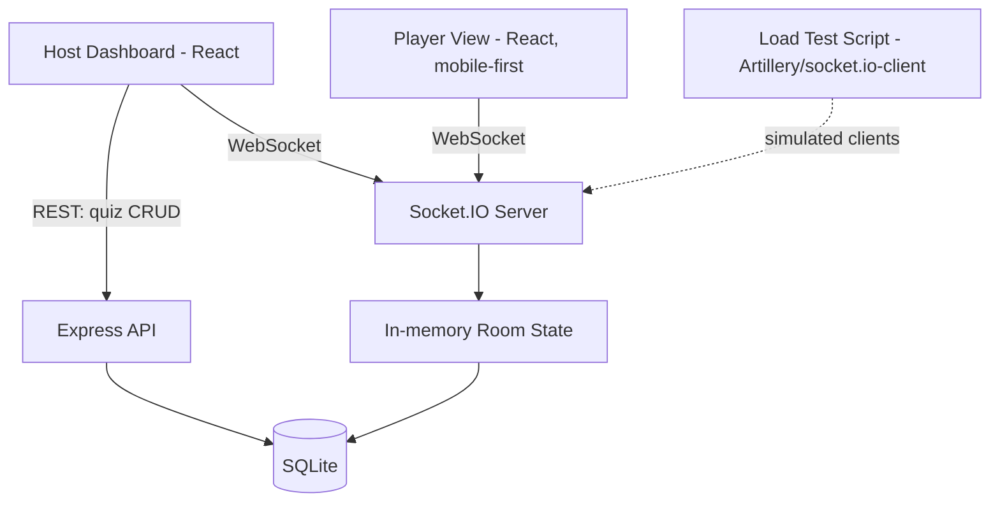
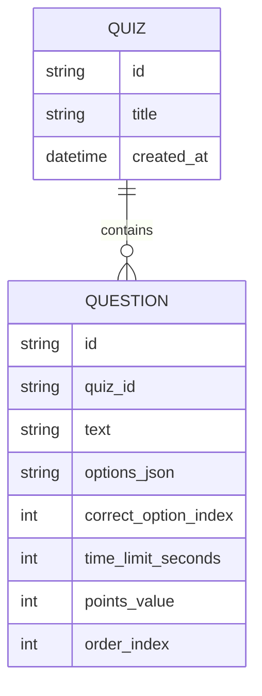

# QuizArena — Architecture

> **Status:** Draft | **Last updated:** 2026-09-22

## 1. System Overview
QuizArena is a single-server, real-time application. One Node.js process serves both a REST API (for quiz creation/management, backed by a local SQLite database) and a Socket.IO real-time layer (for the live game: room join, question broadcast, answer collection, scoring, leaderboard). It runs entirely on the host's own machine — either accessed via `localhost` for solo testing, or via the host machine's LAN IP so other devices on the same WiFi network can join as players. There is no cloud hosting, no external database, and no third-party auth — everything needed to run a live 100+-person quiz session lives in one local process.

## 2. Architecture Diagram

## 3. Tech Stack
| Layer | Technology | Rationale |
|---|---|---|
| Frontend (Host + Player) | React (Vite) | Fast local dev server, no build service needed, single codebase serves both host and player views as separate routes |
| Real-time | Socket.IO | Built-in room abstraction maps directly to "one room per game PIN"; handles reconnection and fallback transports out of the box — saves significant build time over raw WebSockets |
| Backend API | Node.js + Express | Lightweight REST layer for quiz CRUD, runs in the same process as the Socket.IO server |
| Database | SQLite (file-based) | Zero setup, zero server process, free, sufficient for quiz/question storage at this scale; avoids running a separate DB service |
| Load Testing | Artillery + socket.io-client scripts | Free, open-source, purpose-built for simulating concurrent WebSocket clients |
| Hosting/Infra | None (local machine / LAN only) | Explicit project constraint — no deployment, so this row intentionally has no cloud component |
| Auth | None (host = whoever runs the process locally; players = nickname-only) | No signup friction for players; host auth isn't needed since only the person running the server can access host controls locally |

## 4. Component Breakdown

### 4.1 Express API (Quiz Management)
- **Responsibility:** CRUD for quizzes and their nested questions; serves the host's quiz library.
- **Interfaces:** REST endpoints under `/api/quizzes` (see API Design below).
- **Depends on:** SQLite database.

### 4.2 Socket.IO Server (Live Game Engine)
- **Responsibility:** Room lifecycle (create/join/leave), question broadcast, answer collection and validation, server-side timers, scoring, leaderboard computation, host control handling, reconnection.
- **Interfaces:** Socket.IO events (see Component 4.3 for the event contract).
- **Depends on:** In-memory room state; reads quiz data from SQLite when a session starts.

### 4.3 Room State Manager (In-Memory)
- **Responsibility:** Holds the live, ephemeral state of each active room — player list, scores, current question index, room phase (lobby/question-active/results/ended), per-question answer records.
- **Interfaces:** Internal module used by the Socket.IO server; not exposed externally.
- **Depends on:** Nothing external — pure in-memory JS objects/maps keyed by room PIN. (Designed so this could later be swapped for Redis if the project ever needed multi-process scaling, but that's explicitly out of scope now.)

### 4.4 Host Dashboard (React)
- **Responsibility:** Quiz builder UI, session launch, live lobby view, question control panel, live leaderboard view.
- **Interfaces:** Consumes REST API for quiz CRUD; consumes Socket.IO events for everything live.
- **Depends on:** Express API, Socket.IO server.

### 4.5 Player View (React, mobile-first)
- **Responsibility:** Join screen (PIN + nickname), waiting screen, question/answer screen, personal result screen.
- **Interfaces:** Socket.IO events only (no direct REST usage).
- **Depends on:** Socket.IO server.

### 4.6 Load Test Harness
- **Responsibility:** Simulates 100+ concurrent Socket.IO clients joining a room and answering in a burst, to validate scale before any live demo.
- **Interfaces:** Standalone Node script using `socket.io-client`, orchestrated via Artillery config for reporting.
- **Depends on:** A running instance of the Socket.IO server (typically `localhost` during testing).

## 5. Data Model

Note: Rooms, players, live scores, and per-question answers are **not** persisted to SQLite by default — they live in memory for the duration of a session (Room State Manager, 4.3), since a session is a one-time live event, not a record that needs long-term storage. Only quizzes/questions (the reusable content) are persisted. Final results per session could optionally be written to SQLite at quiz end if the host wants a saved record — flagged as an open question in the PRD.

## 6. API Design
| Method | Endpoint | Purpose | Auth required |
|---|---|---|---|
| GET | /api/quizzes | List all saved quizzes | No (local-only host) |
| POST | /api/quizzes | Create a new quiz | No |
| GET | /api/quizzes/:id | Get a quiz with its questions | No |
| PUT | /api/quizzes/:id | Update quiz title | No |
| DELETE | /api/quizzes/:id | Delete a quiz | No |
| POST | /api/quizzes/:id/questions | Add a question to a quiz | No |
| PUT | /api/quizzes/:id/questions/:qid | Edit a question | No |
| DELETE | /api/quizzes/:id/questions/:qid | Delete a question | No |

**Socket.IO event contract (not REST, but the other half of the API surface):**
| Event | Direction | Purpose |
|---|---|---|
| `room:create` | Host → Server | Start a session for a given quiz ID, receive a PIN |
| `room:join` | Player → Server | Join a room with PIN + nickname |
| `lobby:update` | Server → Host | Live player list/count in lobby |
| `question:show` | Server → Room | Broadcast the current question |
| `answer:submit` | Player → Server | Submit an answer for the active question |
| `answer:count` | Server → Host | Throttled live answer count |
| `question:results` | Server → Room | Correct answer reveal + leaderboard |
| `host:control` | Host → Server | Pause / skip / end |
| `player:reconnect` | Player → Server | Rejoin with existing session token |

## 7. Infrastructure & Deployment
No cloud infrastructure by design. The entire app runs as a single Node.js process on the host's own machine:
- **Local-only testing:** `localhost:PORT` for both host and player views (useful for solo development and the load test harness).
- **LAN demo:** Server binds to `0.0.0.0` instead of `localhost`; any device on the same WiFi network reaches the app via the host machine's LAN IP (e.g. `192.168.1.42:3000/join`). No environments (dev/staging/prod) beyond "local dev" and "LAN demo" are needed given the no-deployment constraint.
- **CI/CD:** Not applicable — there's no deployment target to push to. Version control (Git/GitHub) is still used for source management.

## 8. Security Considerations
Given the local/LAN-only, no-accounts design, the threat model is intentionally narrow:
- **AuthN/AuthZ:** Host controls are implicitly trusted to whoever is running the process on the local machine — no login system. Players are identified only by nickname + a server-issued session token (used for reconnection, not security).
- **Data protection:** No sensitive personal data is collected — nicknames only, no emails/passwords. Quiz content is stored locally in SQLite, not transmitted externally.
- **Abuse on LAN:** Since anyone on the same WiFi can technically join with any nickname, there's no protection against a participant impersonating another nickname if the original disconnects before reconnecting — acceptable given the casual/event context, but noted here rather than silently assumed safe.
- **Key management:** Not applicable — no external API keys or secrets are used anywhere in this stack.

## 9. Scalability & Performance
- **Expected load:** A single active room with 100-150 concurrent participant sockets. This is comfortably within what a single Node.js/Socket.IO process handles without special tuning.
- **Bottlenecks to watch:** Answer storms (most players answering in the final seconds) and join storms (everyone joining right before start) are the two realistic pressure points — both addressed by in-memory O(1) lookups (room PIN → room object) and throttled/debounced broadcasts rather than per-event recomputation (see Feature 9 and 13 in feature.md).
- **Caching:** Not needed at this scale — room state lives in memory already, and quiz data is small enough to read from SQLite once per session start and hold in memory for the session's duration.
- **Horizontal scaling:** Explicitly not required for this project's scope (single event, single server process). The Room State Manager is still designed as an isolated module so it could be backed by Redis later if multi-process scaling were ever needed — but that's future work, not part of this build.

## 10. Key Technical Decisions & Tradeoffs
| Decision | Alternatives considered | Why this choice |
|---|---|---|
| Socket.IO over raw WebSockets (`ws`) | Raw `ws` library | Socket.IO's built-in room abstraction and reconnection handling directly match this project's needs (rooms-by-PIN, flaky mobile reconnects) and save significant implementation time |
| SQLite over Postgres/MongoDB | Postgres, MongoDB (local install) | No separate database server process to run/manage; a single file is enough for quiz storage at this scale and keeps the "zero setup, zero cost" constraint airtight |
| In-memory room state over persisted-per-event | Persisting every room/answer to SQLite | Live sessions are ephemeral by nature (like Kahoot); persisting every event would add complexity with no clear benefit given the no-deployment, single-event use case |
| React (Vite) for both host and player views | Separate frameworks per view, plain HTML/JS | One codebase, one dev server, faster to build; Vite's local dev experience needs no external build service |

## 11. Open Technical Questions
- [ ] Should final quiz results (leaderboard) be optionally persisted to SQLite at quiz end, for a host who wants a record afterward?
- [ ] What's the right throttle interval for answer-count/leaderboard broadcasts during an answer storm (needs empirical tuning during Phase 4 load testing)?
- [ ] Should the player view show the live leaderboard, or should ranking be host-only to reduce social pressure/gaming?
