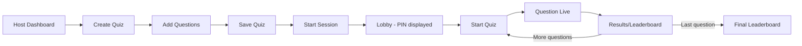
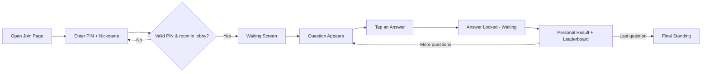

# QuizArena — Design Document

> **Status:** Draft | **Last updated:** 2026-09-22

## 1. Design Principles
- **Glanceable at speed:** Players make decisions in seconds under a countdown — options must be readable and tappable without hunting, especially on a phone.
- **One screen, one job:** Each screen (join, waiting, question, results) does exactly one thing — no dashboards-within-dashboards on the player side.
- **Host sees more, players see less:** The host dashboard carries the operational detail (live counts, controls); the player view stays minimal and reactive.
- **Big, obvious state changes:** Because sync matters (everyone should feel "in the same moment"), transitions between phases (lobby → question → results) should be visually unmistakable, not subtle.
- **Thumb-friendly by default:** Every player-facing tap target is designed for a phone held in one hand, not a mouse cursor.

## 2. User Flows

### 2.1 Host: Create and Run a Quiz

Host builds a quiz once, then can reuse it for future sessions. Starting a session is a single click from the quiz library, producing a PIN immediately.

### 2.2 Player: Join and Play

No signup step exists anywhere in this flow — PIN and nickname are the entire onboarding.

## 3. Key Screens / Views

### 3.1 Host: Quiz Builder
- **Purpose:** Create/edit a quiz's questions before a session starts.
- **Key elements:** Quiz title field, ordered question list, per-question editor (text, options, correct answer toggle, time limit, points), save/add-question buttons.
- **States:** empty state — "No questions yet, add your first one"; loading — quiz list skeleton while fetching from API; error — inline message if save fails, entered text preserved; populated — full question list with reorder/edit/delete per row.

### 3.2 Host: Lobby
- **Purpose:** Display the PIN and track who has joined before starting.
- **Key elements:** Large PIN display (readable across a room on a projector), live player count, scrollable nickname list, "Start Quiz" button.
- **States:** empty state — PIN shown, "waiting for players..."; populated — count and names updating live; loading — brief "generating room..." on session creation.

### 3.3 Host: Live Question Control
- **Purpose:** Monitor the active question and control pacing.
- **Key elements:** Question text + options (host's own view, correct answer highlighted for the host only), countdown, live "N/Total answered" counter, Pause/Skip/End buttons.
- **States:** loading — brief transition state between questions; populated — live counter ticking up; error — rare socket disconnect from host side shows a reconnect banner.

### 3.4 Host: Leaderboard
- **Purpose:** Show ranked standings between questions.
- **Key elements:** Ranked list (position, nickname, score, movement indicator ↑/↓/–), "Next Question" button (or "View Final Results" on the last question).
- **States:** populated only — this screen only appears once scoring for a question is finalized, so there's no meaningful empty/loading state beyond a brief transition animation.

### 3.5 Player: Join
- **Purpose:** Entry point — PIN and nickname.
- **Key elements:** PIN input (numeric keypad on mobile), nickname input, Join button.
- **States:** empty state — default form; error — invalid PIN or taken nickname shown inline, form retains entered PIN; loading — brief "joining..." spinner on submit.

### 3.6 Player: Waiting Screen
- **Purpose:** Hold state between joining and the quiz starting, or between questions.
- **Key elements:** Nickname confirmation ("You're in as [nickname]"), simple waiting indicator.
- **States:** populated only — this is inherently a passive/idle screen.

### 3.7 Player: Question & Answer
- **Purpose:** The core interaction — read the question, tap an answer, under time pressure.
- **Key elements:** Question text (large, top of screen), 2-4 large color-coded answer buttons (shape + color coding, not color alone, for accessibility), visible countdown bar.
- **States:** populated (answering) — buttons active and tappable; locked (answer submitted) — buttons disabled, selected one visually confirmed, "waiting for others..."; error — rare submission failure shows a retry affordance before time runs out.

### 3.8 Player: Personal Result
- **Purpose:** Immediate feedback on the just-closed question.
- **Key elements:** Correct/incorrect indicator, points earned this round, current rank/score.
- **States:** populated only — always shows a concrete result (including "no answer" as a distinct state from "wrong").

## 4. Component Library / Style Guide
| Token | Value | Usage |
|---|---|---|
| Primary color | #5B4FE8 (indigo) | Primary actions, active states, host branding |
| Answer color 1 | #E74C3C (red) + triangle icon | Option A — color + shape, not color alone |
| Answer color 2 | #3498DB (blue) + diamond icon | Option B |
| Answer color 3 | #F1C40F (yellow) + circle icon | Option C |
| Answer color 4 | #2ECC71 (green) + square icon | Option D |
| Font — heading | Inter, bold, 24-40px depending on screen | Question text, PIN display, leaderboard headers |
| Font — body | Inter, regular, 14-16px | Labels, secondary text, form fields |
| Spacing scale | 4px base unit (4/8/16/24/32) | Consistent padding/margins across host and player views |

## 5. Interaction Patterns
- **Answer selection:** Tapping an option immediately locks it (no "confirm" step) to keep the pace fast and mirror Kahoot's snappy feel; a brief animation confirms the tap registered before the "locked" state shows.
- **Countdown feedback:** A shrinking progress bar (not just a numeric countdown) gives players an at-a-glance sense of urgency without needing to read numbers.
- **Leaderboard movement:** Rank changes animate (slide up/down) rather than snapping instantly, so players can track "did I move?" at a glance.
- **Form validation:** Inline, immediate (e.g. nickname taken) rather than only on submit — reduces friction during a live join rush.
- **Host control feedback:** Every host action (pause/skip/end) shows an immediate local confirmation before the broadcast round-trip completes, so the host isn't left wondering if a click registered.

## 6. Accessibility
- Color-coded answers always paired with a distinct shape/icon, not color alone, for color-blind participants.
- Target WCAG 2.1 AA contrast ratios for all text against background colors, including on the colored answer buttons.
- All interactive elements sized at minimum 44x44px touch targets on the player view.
- Countdown communicated both visually (progress bar) and numerically (seconds remaining), not through color/animation alone.
- Full keyboard navigability on the host dashboard (host is more likely to be on a laptop).

## 7. Responsive / Platform Behavior
- **Player view:** Designed mobile-first (assume a phone browser as the primary player device); scales up gracefully to tablet/laptop for players who join from a larger screen.
- **Host view:** Designed for a laptop/desktop screen, since the host is running the session and likely projecting their screen; not optimized for small viewports.
- **Breakpoints:** Single-column layout under ~600px (player default), host dashboard assumes ≥1024px width for full control panel layout.

## 8. Edge Cases & Error States
- Edge case: Player joins with a nickname that's a duplicate → inline prompt to choose another before join completes.
- Edge case: Player's device loses connection mid-question → on reconnect, they land on whatever the room's current phase actually is (not stuck on the old question) — see architecture.md Feature 12 for the underlying mechanism.
- Edge case: Host accidentally clicks "End" mid-quiz → confirmation prompt before ending, since it's irreversible for that session.
- Error state: PIN doesn't match any active room → clear, specific message ("No active quiz with that PIN") rather than a generic error.
- Error state: 100+ nicknames in the lobby list → switch to a count-only or scrollable/virtualized view past a threshold (~30 names) to avoid rendering lag on the host screen.

## 9. Open Design Questions
- [ ] Should players see the leaderboard at all, or should ranking stay host-only to reduce competitive pressure on younger/casual audiences?
- [ ] Should there be a visual "podium" moment at the very end (top 3 highlighted), matching the Kahoot-style finale, or a simpler final list?
